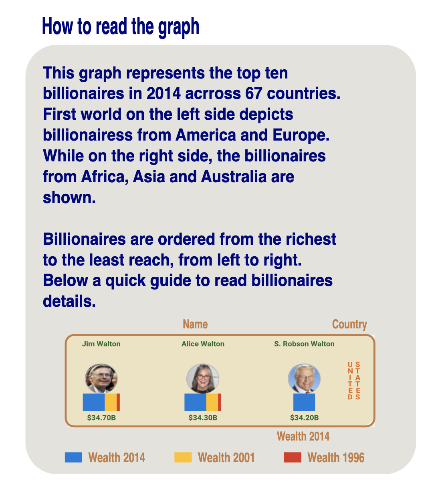
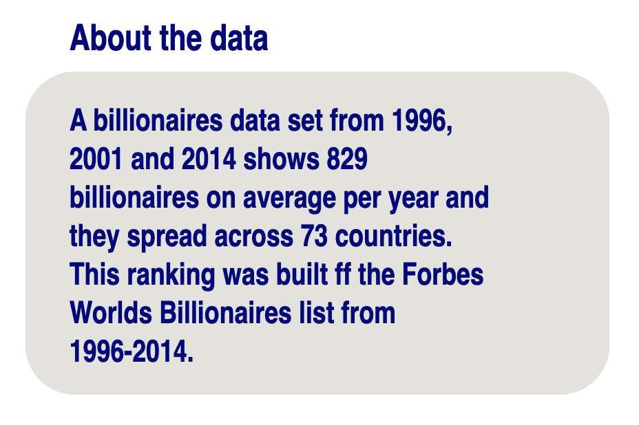
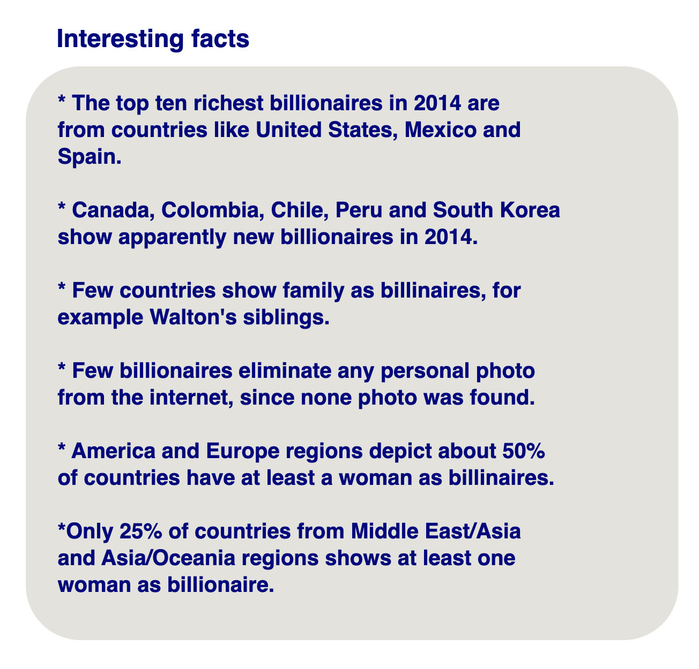
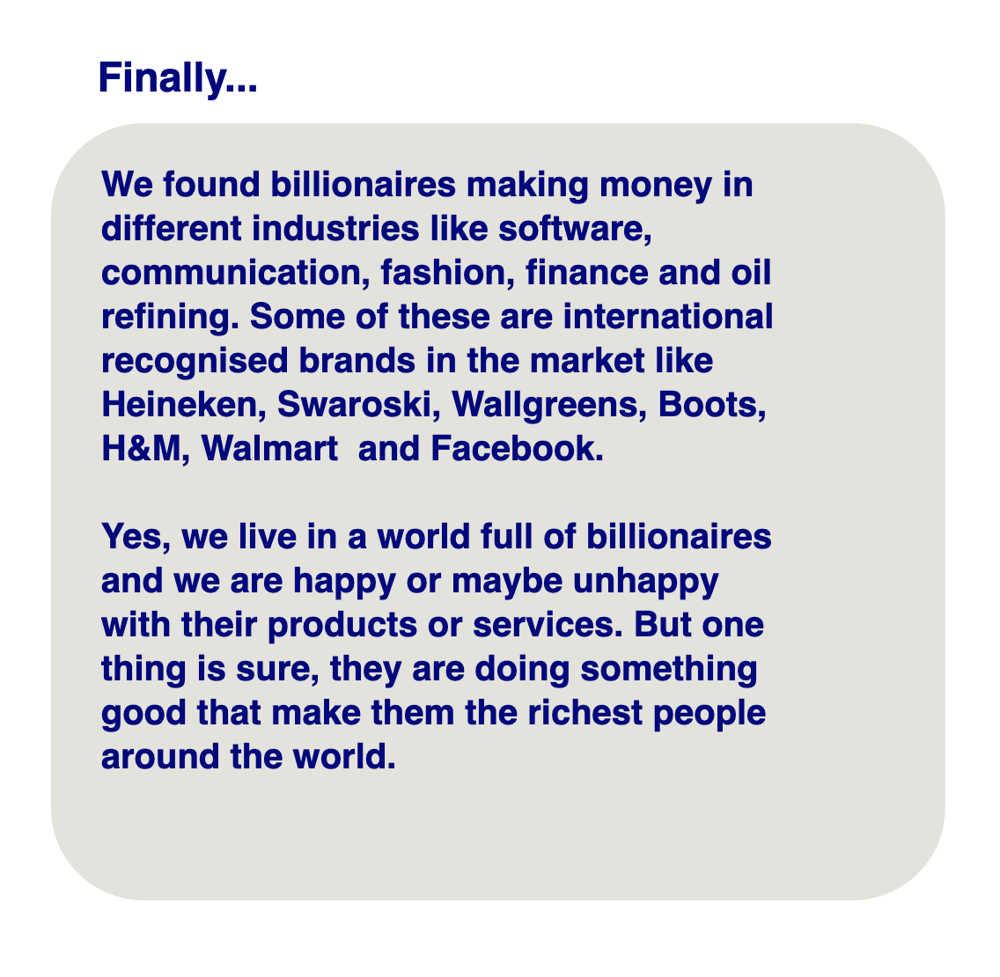

## **IMPLEMENTATION OF BILLIONAIRES POSTER**
The purpose of this report is to present the implementation process of the billionaire’s poster which includes the final visualisation. This process included the following steps:

* Selection of the sections to be included in the poster. These sections allow to support the story telling.
* The management of canvas space to organise each element. We defined the number of columns of the poster.
* Placing each element of the poster. The elements were placed following the Gutenberg diagram.

### **I. IMPLEMENTATION**

The implementation of the poster was divided in two steps. The first step is defining the sections to include in the poster. The second is the design of the poster to place each section.

#### **A. SELECTION OF SECTIONS**
The sections to be shonw in billionaires poster were selected to guide, inform and engage the end-user. These sections are as follows.

* The first section includes the "How to Read the Graph" guide as it shown in "Figure 1", which is placed on the upper left corner of the poster. This is located in the primary optical are because this will help the user to understand better the visualisation.

 
 Figure 1. "How to read the Graph" guide

*  The second section shows the visualisation which is placed on the upper right corner of the poster. This place is know as the strong fallow area which allow the user to see the visualisation after reading the "How to read the Graph" section.
* The third section is the ”About the data“ section and it's depicted in "Figure 2". This is placed below the guide section and it just provides additional information about the origin of the data.

 
 Figure 2. "About Data" section

* The fourth section is the ”Interesting facts“ section which is shown in "Figure 3". It’s located below the visualisation section and it depicts a bullet list of facts that user could interpret from the visualisation.

 
 Figure 3. "Interesting facts" section

* The final section is the "Finally..." section. It’s depicted in "Figure 4" and located on the lower right corner of the poster. It’s depicts a brief conclusion about the findings from the visualisation.

 
 Figure 4. "Finally" section

#### **A. DESIGN OF POSTER**

The Undergraduate Research Center [1] proposed the following guidelines to implement a good poster.The poster is design following the next guidelines.

* Poster flow. First we divided our canvas in three columns. Then, the Gutenberg diagram is used to placed our sections based on importance.
* Fonts and formatting. The following guidelines were followed:

    
    - Avoided use excessive text so the user is able to read the poster from 3 to 5 minutes.
    - Kept the heading sizes consistent according their importance.
    - Left enough vertical space between lines.
    - Used the same font type for title, headings, section’s
    body and visualisation’s labels.
    - Used a bullet points to show interesting facts.
    - Left enough space between each section, and section
    title and body.
    - Align the section’s body to the left to be easy to
    read.

* Font sizes. We selected the following font sizes for each element of the poster. These font sizes allow to the user to read the poster from about 14 feet of distance.
    - Main title: 120 pt.
    - Section title: 70 pt.
    - Section body: 50 pt.
    - Billionaire’s name: 12 pt.
    - Billionaire’s country: 12 pt.
* Font combinations. We used only one font which is Robotto, since too many fonts could distract the user. To highlight important parts for the user, a Robotto Italic Medium style is used.
* Color/Contrast. We used few colors to avoid our poster looks disorganized. White color is used for the heading, orange color for the section’s body and yellow color for the borders.
* Color background. A simple background of blue color is used to avoid distracting the user from the content.

We used the Inkscap software to implement the poster since it was easy to add each element of the poster and change its color or fonts. The final poster is shown in the following "Fig. 5" .

 
 Figure 5. Final billionaire’s poster

### **II. STORYTELLING**

When we combined all these elements like sections and the visualisation, we could give a better picture about the story we want to tell to the user. This poster starts with a nice title which generates expectation on the user. Also, since this poster has a quick guide to read closer to the visualisation, then the user could easily understand the purpose of our visualisation which is showing the top ten billionaires per country in 2014. Even, the user could easily compare the each billionaire’s wealth in the same country to know which is the riches. Also, the billionaire’s wealth could be compare between billionaires from different countries. Moreover, the user could contrast the information from the ”Interesting facts“ section by looking at the visualisation.

### **REFERENCES**

[1] U. Davis, “Poster design principles tips,” pp. 1–2.