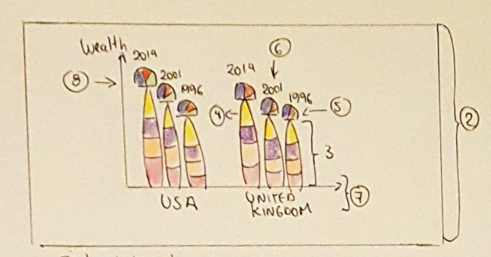

## **IMPLEMENTATION OF BILLIONAIRES VISUALISATION**
The implementation of billionaires visualisation includes the following steps:
* The refinement of the final visualisation design to harness the space of A1 paper and present enough detail of the billionaire to catch user’s attention.
* The implementation of the visualisation using Processing tool to create and organise every element of the visualisation. It includes the analysis of the results to show how every element of visualisation is displayed and organised.
* Reflection about the final visualisation and potential improvements. This part includes comments from the design to the implementation stage. Also, it includes any future work to be done to improve the storytelling.

### **I. REFINEMENT OF FINAL DESIGN**
The selected choice of visualisation "Fig. 1" which combines a stacked bar chart with circular sectors in one graph was changes for another that shows historical wealth per billionaire.
Then, we sketched a second visualisation "Fig. 2" which shows historical wealth’s per billionaire using bars as triangles and billionaire’s photo. Each triangle sector will show the billionaire’s wealth per year. All the billionaires are grouped per country and placed on a triangular inset. The billionaires are ordered from the richest to the least reach inside the triangular inset. Moreover, the countries are grouped per region and located near its region. Also, the name initials of the billionaire is placed above his photo.

 
 Figure 1. Selected choice of visualisation from five design of sheets

 
 Figure 2. Second choice of visualisation

 Finally, we updated the previous choice for a better version which is show in "Fig. 3". Since the data set has the information of 2614 billionaires, then we decided to show historical data of wealth from top ten billionaires per country in 2014. Also, some aspects of the previous design are also changed:
* The triangle bar is swapped for a horizontal bar which shows the wealth across the three years to have more space on the vertical axis.
* A circular mask is applied to the billionaire’s photo.
* The name initials are swapped for full names.
* The billionaire’s wealth in 2014 is placed below the horizontal stacked bar.
* The triangular inset is swapped for a rectangular inset and an triangular shape is added to point the location on the map.
* The country’s name is shown on the right side of the inset if this is located on the left side of the world’s image, on the contrary the country’s label is located on the left side.

 
 Figure 3. Africa and Asia/Oceania regions from final visualisation

### **II. IMPLEMENTATION OF VISUALISATION**
The implementation of the main visualisation was divided in two steps. The first step is loading the billionaire’s data from the data set. The second one is drawing every element of the main visualisation.

#### **A. Loading the billionaire’s data**

The Processing tool version 3.5.4 is used to load the data from the billionaire’s data set. Also, we used some java libraries like HashMap, Map, List and Collections to store, filter and order the data. Only some fields from this data set are loaded:
* Name. The full name of billionaire.
* Location.citizenship. The name of the country that this billionaire citizenship with.
* Rank. The rank of this billionaire compared to the rest of the billionaires reported on.
* Year. The year that data about this billionaire was collected.
* wealth.worth in billions. The number of billion of dollars that this billionaire is worth.

Once the data was loaded, we filtered it by selecting only the billionaires from 2014 and ordering by their rank. Then, we loaded the data of these billionaires from previous years 1996 and 2001.

#### **B. Drawing the final visualisation**
To set up the size of the canvas we considered the resolution of 9993 and 4500 pixels at 300 ppi. In order to draw the visualisation, we divided it in the following parts:

* Two worlds images. The first world image is loaded on the left side shows America and Europe regions and is shown in "Fig. 4". The second one "Fig. 5" is loaded on the right side depicts Africa and Asia/Australia regions. The two images were gotten using Google My Maps. These images are useful to located the billionaire’s countries and the user could compare the richest people between countries.
* Billionaire marker. This marker comprises the circular photo, full name, horizontal stacked bar, wealth in 2014. One marker example is shown in "Fig. 6". So, the user could see the historical data of wealth and even billionaire’s face and full name.

    - Fullname.This name is loaded from the billionaire’s data set.
    - Circular photo. Each photo is gotten from different websites like Forbes [1], Wikipedia [2], NZ Herald [3], CelebFamily [4] and Marribal [5].
    - Stacked bar. This shows the billionaire’s wealth in 2014, 2001 and 1996.
    - Wealth in 2014. This value is gotten from the data set.

 * Inset. This inset contains the top ten billionaires per country. It also has an triangular shape that points to the billionaire’s country over the map. Hence, the user could compare billionaires in the same country and see who is the richest.

 
 Figure 4. World image shows America an Europe regions

 
 Figure 5. World image shows Africa an Asia/Oceania regions

 
 Figure 6. Example of billionaire’s marker

 Finally, all these elements are organised in one graph as we see in "Fig. 7". Hence, the top ten billionaires per country are located in one inset and then the insets are located near to each region in the world.

 
 Figure 7. Final visualisation

##### **1. Algorithms**
To begin drawing our visualisation, we started setting the coordinates for each region, then per billionaire marker and finally we defined the coordinates for each country. The next steps were followed:

* Defined the coordinates of the two world’s images.
* Since four regions are determined which are America, Europe, Africa and Asia/Australia, a pair of initial coordinates are set per region.
* The coordinates per billionaire marker are calculated based on the initial coordinates.
* The coordinates per country are defined by inspection and stored in the source code.
* The two world images are loaded and placed using their coordinates.
* Drew the insets around each world image. First we drew a rectangular shape and then a triangular shape which points to the world image.
* Drew each billionaire’s marker. The label which shows billionaire’s full name is drawn the top of the marker. The billionaire’s photo is shown and a circular mask is applied to it. This photo is placed below the name’s label. After that, we drew the stacked bar as individual rectangular shapes with different colours. Finally, a wealth’s labels which shows the wealth in 2014.

##### **1. Colors**

The selected colors were chosen considering the colorblindness that some people could have. We used the website [6] from David Nichols to chose our colors. The above image show the selected colors for stacked bars. As we see in [6, "Fig. 8"] the colors from the stacked bars have a good contrast even for people with colorblindness. The first column shows the true colors, the rest of the columns show the colors that a person with protanopia, deuteranopia or tritanopia would see them. Also, the [6, "Fig. 9"] and [6, "Fig. 10"] shows the colors for name and country labels and their equivalents in colorblindness colors.

 
 Figure 8. Stacked Bar colors

 
 Figure 9. Name and Inset colors

 
 Figure 10. Country and Inset colors

### **III. REFLECTION**

In order to implement the main visualisation we updated the final design from the five design of sheets. First, we decided to show only the top ten billionaires per country. Also, the billionaires were ordered in ascending way based on their wealth, so the users could compare with other billionaires to find out which are the richest people. Moreover, the billionaires are grouped by country, in this way the user is able to see the richest billionaires per country. Even, each inset is pointing to country’s location on a map and have a label showing the country’s name. This visualisation has enough detail to guide the user and find the useful information about billionaires and allow him to compare billionaire’s wealth between their pairs in the same country. Even, this visualisation allows to compare billionaires in different countries. However, it’s necessary to include this visualisation in a poster and add it some elements to support our storytelling.

### **REFERENCES**

 [1] Forbes, “Profile.” https://www.forbes.com/, 2022. [Online; accessed 14- May-2022].
 [2] Wikipedia, “Article.” https://en.wikipedia.org/wiki/Main Page, 2022. [Online; accessed 14-May-2022].
 [3] N.Herald,“Article.”https://www.nzherald.co.nz/,2022.[Online;accessed 14-May-2022].
 [4] Celeb, “CelebFamily.” https://www.celebfamily.com/, 2022. [Online; accessed 14-May-2022].
 [5] Marribal, “Business Profile and News Articles.” https://marribal.com/, 2022. [Online; accessed 14-May-2022].
 [6] D. Nichols, “Coloring for Colorblindness.” https://davidmathlogic.com/ colorblind/, 2022. [Online; accessed 17-May-2022].

