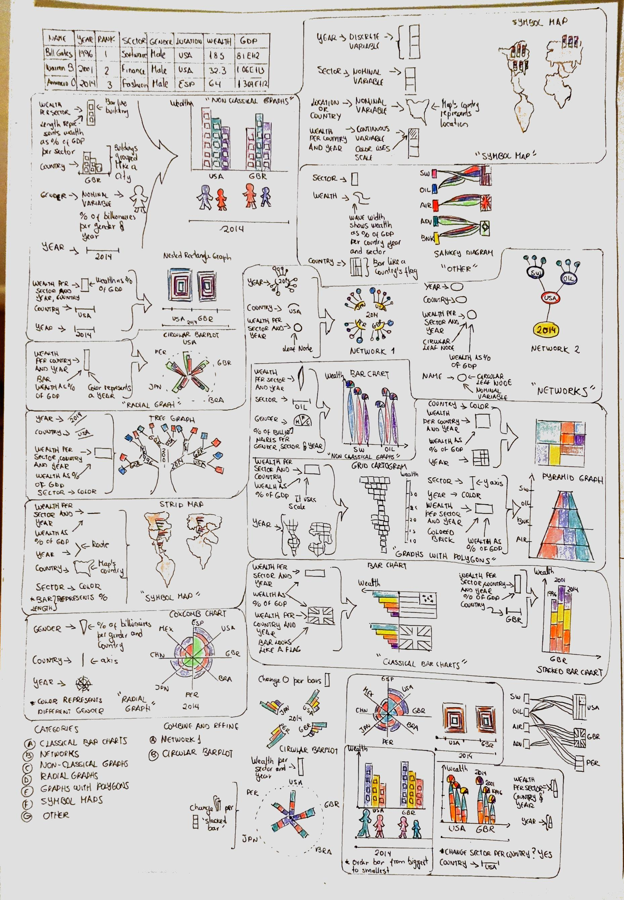
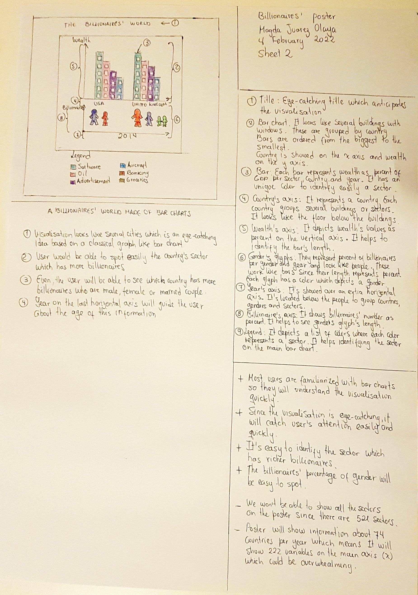
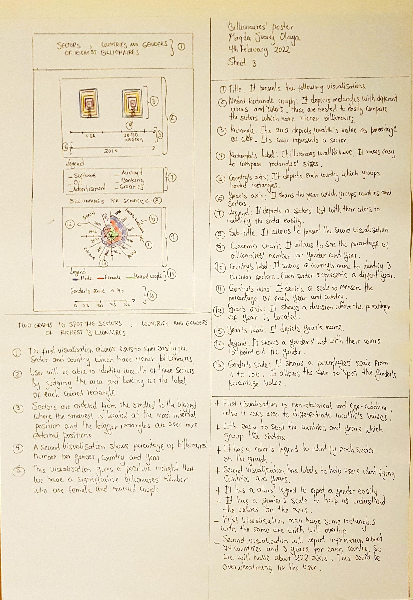
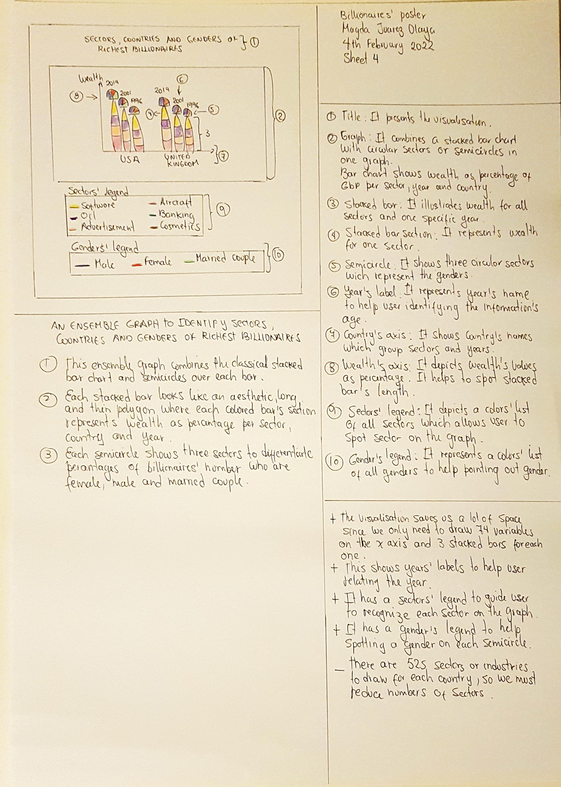
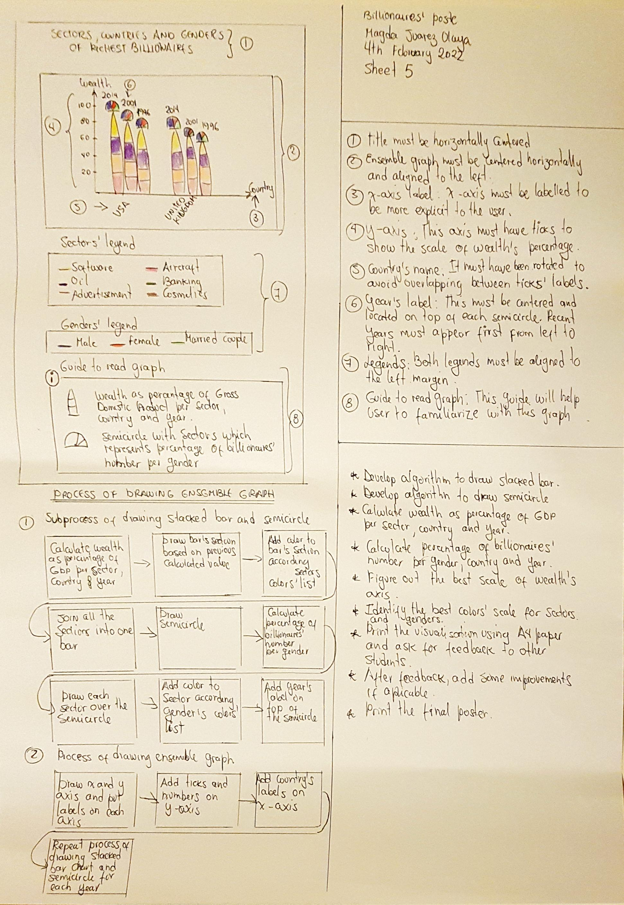
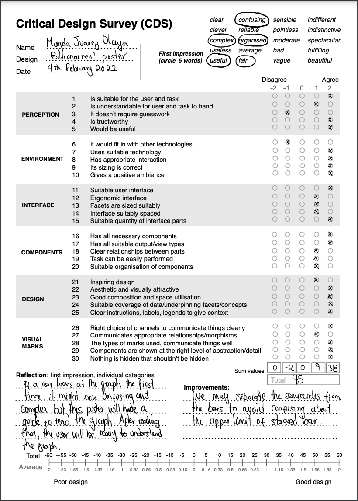

## **Sketching Billionnaires' poster using five design of sheets**

### **I. SKETCHING BILLIONAIRES’ POSTER USING FIVE DESIGN OF SHEETS**

* **The first sheet** "Fig. 1" was made using different retinal variables like length, color, shape and area. We used some classical graphs  such as bar charts, stacked bar charts and symbols maps. We included other uncommon graphs like networks, grid cartogram, Sankey diagram and ensemble graphs. A brief description of each graph's elements are depicted. 
All of the graphs are grouped in sevent categories such as: Classical bar charts, networks, non-classical graphs, radial graphs, graphs with polygons, symbol maps and other. To have extra design ideas we decided to combine and refine Network1 graph and circular barplot. For the Network 1 graph we swapped circular nodes per horizontal bars and for the circular barplot we swapped the horizontal bars for horizontal stacked bars.
Finally, three visualisations were selected which were two ensemble graphs and the last one comprises two complementary visualisations. One of the ensemble graph looks like a worlds which depicts sectors grouped by country. Theses sectors looks like buildings which are attractive to the users. Also, billionaires’ number are represented by glyphs which look like people. The second ensemble graph comprises a stacked bar chart which include semicircles on the top of each bar. This semicircle shows percentage of billionaires’ number per gender, country and year. The last selected visualisation comprises a nested rectangle graph and a coxcomb chart. The first represents wealth as percentage per sector, country and year and the second shows billionaires’ number as percentage per gender, country and year.

 
 Figure 1. First sheet.

* **The second sheet** "Fig. 2" describes with more detail the design of the first ensemble graph. This is comprised for two bar chats one over the other. The first bar chart depicts the average wealth per sector and country which is represented by horizontal bar. The second bar chart shows also horizontal bars which depicts the average wealth per gender and country. The horizontal bars of the last chart have a person's shape. The advantages of this design are:
    - The graph is easy to understand since most of the users are familiarized with bar charts.
    - It's eye-catching since it looks like a city with people.
    - Bar's height is easy to read and interpret for any user.
    - It provides guide for the user to understand quickly the visualisation.
    - It has a colors' scale for sectors to help user identify the sector easily.

    However, two hundred twenty variables need to be added to the x axis, seventy four countries for each year, which will be overwhelming for the user.

 
 Figure 2. Second sheet.

* **The third sheet** "Fig. 3" shows with detail the design of two complementary and different graphs. 
    - The first is a nested rectangle graph which represents wealth as percentage per sector, country and year. Each rectangle uses two retinal variables like color and area to depict average wealth. 
    - The other is a coxcomb chart which depicts percentage of billionaires per gender, country and year. Each sector represents the percentage of billionaires using sector's length and color. Also, it has some labels of the year and country to guide the user.

    Some advantages of this graph are as follows
    - Both graphs allow user to read and understand quickly information about billionaires. 
    - First graph allows user to identify quickly and easily the sector and country with richest billionaires. 
    - User could understand easily the information depicted in the second graph by looking at the sector's length and colors. Also, the labels provide extra help to support the storytelling.
    - Both graphs shows a legend to differentiate the sector and gender colors. The second graph depicts gender's scale to help reading the sector's length.

    However, some rectangle’s areas will overlap since there may be some rectangles with the same area.

 
 Figure 3. Third sheet.

* **The forth sheet** "Fig. 4" depicts the second ensemble graph which comprises a stacked bar chart with semicircle on top of each bar.
Each section of the bar has a different length and color which depicts the average wealth per sector, country and year. A y-axis is located on the left side to help reading the lenght of the bar's section. Also, a x-axis is placed underneath the bars to read which country this information belongs to. 
The semicircle illustrates the  percentage of billionaires per gender, country and year. The semicircle sectors have diffent sizes and color to differentiate the average wealth per gender. Some country labels are located on top of each semicirlce to guide the user. 
This design presented some advantages like:
    
    - It presents a good title which informs the user about the information who is going to read.
    - It provides additional elements to support the storytelling like two axis, labels and two legends. Both legends use colors to differentiates elements like sector and gender.
    - This visualisation saves a lot of space since seventy four country will be drawn over the x-axis.

    However, the number of sectors to draw are high about 525, which could be so overwhelming for the user.

 
 Figure 4. Forth sheet.

* **The fifth sheet** "Fig. 5" just add more fine detail to the last ensemble graph by adding a guide to read it. This guide allows user to understand and familiarize with this kind of graph. The legend add additional details about how to interpret the horizontal stacked bars and semicircles. This sheet includes a diagram to show the process to develop the ensemble graph. Also, it describes the main requirements to make the final visualisation. 
Furthermore, this sheet describes the process to draw this graph and the main requirements to make the final visualisation. These requirements are as follows:

    - Develop the algorithms to draw the stacked bars and the semicircle. 
    - Calculate the average wealth per sector, country and gender and also per gender country and year.
    - Identify the colors’ scale for sectors and gender. 
    - Ask for feedback to other students to improve the design.

 
 Figure 5. Fifth sheet.

### **II. CRITICAL DESIGN SURVEY**

Although our critical design Survey (CDS) "Fig. 6" qualifies the final visualisation as a good design, we still have some improvements to make such as separate the semicircle from the top of the bar to avoid confusing the user about the upper limit of each bar. Our first impressions about our final poster design are detail as follows:

* Complex. Although the visualisaion shows two common graphs like stacked bars and semicircle sectors, it looks a little bit complex at the first sight. So, a guide to read the graph is included to help the user to understand better the visulisation.
* Organised. The horizontal stacked bars will be ordered from the richest to the least reach and the semicircle sector are ordered from the greatest number to the lowest number of billionaires. Both orders help end-user to understand the storytelling of the visualisation.
* Useful. The visualisation provides useful information about the richest people per sector, year and country. Also, it gives information about which gender has a great number of billionaires.
* Fair. The visualisation has a fair design since it's combine two common graphs which use the length and area to depict information. This two retinal variables are easy to understand for the end-user.
* Confusing. Since the visualisation shows a semicircle joined to a horizontal stacked bar which is a little bit confusing for the user. 
Since he might not interpret right if the stacked bar limit is the bar's top or the semicircle.

Furthermore, our CDS help us to evaluate our final visualisation design and some takeaways are outlined as follows:

* Perception. It's suitable and understandable for the user and the task, since the final design uses two retinal variable as length and area which are easy to interpret. It requires a little guesswork to read efficiently the graph, so an additional guide for the user needs to be provided in the poster. It's trustworthy since the poster reflects historical information of the Forbes World’s Billionaires list from 1996-2014. It will be useful to give information about which are the countries that have the richest people in the world.
* Environment. Our final poster design won't fit with other technology, because the poster design may change to displayed it as a interactive visualisation. Also, other additional elements could be integrated such as popups to support the storytelling. It has appropiate interaction since the design organize the elements following the Gutenberg diagram where the visualisation is located in the primary optical and strong fallow areas and the guide to read the graph section in the weak fallow and terminal areas. The poster will have a size of A1 with a resolution of 9993 X 7016 at 300 ppi. Since the poster elements are well organized leveraging well the poster space, it gives a positive ambiance to help the user understand the storytelling.
* Interface. The poster design has a suitable and ergonomic user interface since all the elements are well organized to be easy to read and understand for the user. The facets of the poster are reasonable sized but it would be better if the area of the visualisation will be more than 50% of the poster area. Also, it would be better to have more space betweeen the gender's scale and the guide to read the graph. 
* Components. The design has all the necessary and suitable elements like the sector's and gender's legends, also the guide to read the graph to guide the user to read and understand the graph. Although, the guide to read graph section could be moved below the visualisation because this must be the first thing the user must read. The components have been reasonable organized, though could be made like moving the gender's legend next to the sector's legend to have more space for the main visualisation.
* Design. The design is inspiring, aesthetic and attractive, since it combines two common graphs to form one complex but eye-catching visualisation. It has a fair composition and space utilisation but it could be improved so the visualisation section could be bigger. The poster components have suitable coverage of concepts like both color's scale for gender and sector and the guide to read graph. Also, some labels located on the axis and on top of the bars are useful to guide in reading the graph.
* Visual marks. The poster design provides reasonable relationship between the elements but the guide to read the graph section must be placed below the visualisation to be spotted easily for the user. The types of marks the visualisation uses are length and area which are easy to read and understand. The poster components have the right level of detail like the guide to read the graph section which includes a brief description about how to read the bars and semicircles.

 
 Figure 6. Critical Design Survey

